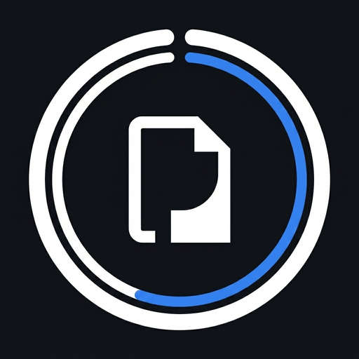

<div align="center">
  
  <h1>PrivacyShield — Advanced Privacy Exposure Tool</h1>
  <p>A comprehensive desktop application built to detect, analyze, and protect Sensitive Personal Information (PII).</p>
</div>

---

## 🛡️ Overview

PrivacyShield is an enterprise-grade desktop security application designed to analyze files, websites, social media profiles, and live screens for exposed sensitive data. It uses advanced Machine Learning, Natural Language Processing (spaCy), and Computer Vision (OpenCV/Tesseract) to identify risks and provides automated remediation strategies.

## ✨ Key Features

- **Document Scanning:** Scan PDFs, Word documents, text files, and images for PII (Aadhaar, PAN, Credit Cards, etc.).
- **Live Screen Monitor:** Continuously monitors designated windows or screens to alert you if sensitive data is visible.
- **Smart Image Blur:** Automatically redacts (blurs) detected faces and ID cards in images to prevent exposure.
- **URL & Social Scanner:** Deep-scan websites and public social media profiles to identify data leaks.
- **Attack Simulation:** Run hypothetical attack scenarios to understand the exploitability of leaked data.
- **Background Agent:** Watch directories silently and trigger native OS alerts when risky files are saved.
- **Detailed PDF Reports:** Generate compliance-ready forensic reports for offline review.

## 🏗️ Architecture

The tool is packaged as a single standalone executable using a modern decoupled architecture:

- **Frontend:** React (Vite) styled with Tailwind CSS, running in Electron.
- **Backend:** FastAPI (Python) running seamlessly in the background.
- **AI Pipeline:** Tesseract OCR, OpenCV, spaCy (en_core_web_sm), and Regex algorithms.
- **Database:** Local SQLite utilizing SQLAlchemy ORM for secure, offline data storage.

## 🚀 Installation & Usage

1. Download the latest installer from the [Releases](#) page.
2. Run `PrivacyShield Setup.exe` to install.
3. The app will launch automatically. First startup may take 1-2 minutes as the AI models (PyTorch/spaCy) initialize.

> **Note:** PrivacyShield processes all your data locally on your machine. No sensitive data is ever uploaded to a cloud server.

## 💻 Building from Source

To compile the executable yourself:

```bash
# 1. Install Python 3.10+ and Node.js
# 2. Setup virtual environment
python -m venv tf_env
tf_env\Scripts\activate
pip install -r requirements.txt

# 3. Build the application (React, FastAPI PyInstaller, Electron)
build.bat 1.2.0
```

## 🔒 Security

This tool is strictly designed for defensive privacy auditing and compliance monitoring.
